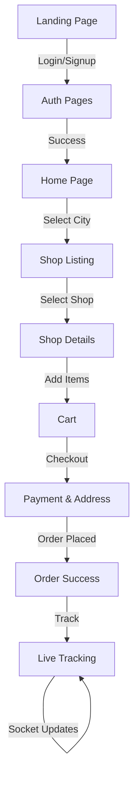

# FoodXpress: Food Delivery Platform - Frontend

This is the frontend for the Real-Time Food Delivery Platform, a modern, responsive, and feature-rich web application designed to connect users with local restaurants. It provides a seamless user experience for browsing menus, placing orders, and tracking deliveries in real-time.

[](https://reactjs.org/)
[](https://vitejs.dev/)
[](https://redux-toolkit.js.org/)
[](https://tailwindcss.com/)
[](https://reactrouter.com/)
[](https://leafletjs.com/)
[](https://socket.io/)
[](https://sonner.emilkowal.ski/)
[](https://axios-http.com/)
[](https://ui.shadcn.com/)
[](https://react-leaflet.js.org/)
[](https://lucide.dev/)

**Live Demo:** [Link to Deployed App](https://foodxpress-in.vercel.app/)

**Backend Repository:** [Link to Backend Repo](https://github.com/saksham2882/Food-Ordering-Platform/tree/main/backend)

---

## Table of Contents

- [Project Overview](#project-overview)
- [Application Workflow](#application-workflow)
- [Tech Stack](#tech-stack-used)
- [Key Features](#key-features)
- [Folder and File Structure](#folder-and-file-structure)
- [Setup and Installation](#setup-and-installation-guide)
- [Build and Deployment](#build-and-deployment)
- [Pages and Routes](#pages-and-routes-documentation)
- [API Integration](#api-integration)
- [State Management (Redux)](#state-management-with-redux)
- [User Experience Highlights](#user-experience-highlights)
- [Contributing](#contributing)
- [Contact](#contact)

---

## Project Overview

The frontend of this application serves as the primary user interface for all actors in the food delivery ecosystem: customers, restaurant owners, and delivery personnel. It is a Single Page Application (SPA) built with React, designed to be fast, intuitive, and visually appealing. The platform allows users to discover nearby restaurants, manage their cart, place orders, and track them in real-time, while providing dedicated dashboards for restaurant owners to manage their shops and menus.

### Key Objectives

- **User-Centric Design:** To provide a seamless and enjoyable browsing and ordering experience for customers.
- **Real-Time Functionality:** To implement live order tracking and status updates using WebSockets.
- **Dedicated Dashboards:** To empower restaurant owners with tools to manage their online presence, items, and orders efficiently.
- **Responsive UI:** To ensure the application is fully functional and looks great on all devices, from desktops to mobile phones.
- **Scalability & Maintainability:** To build a well-structured and documented codebase that is easy to scale and maintain.

---

## Application Workflow

The platform is designed to serve three main roles: Customers, Restaurant Owners, and Delivery Partners.

### 1. Customer Journey



### 2. Restaurant Owner Journey

1.  **Registration:** A restaurant owner signs up with a specific "Owner" role.
2.  **Shop Creation:** From their dedicated dashboard, the owner can create and customize their restaurant's profile, including name, address, and images.
3.  **Menu Management:** The owner can add new food items, including details like name, price, description, and category. They can also edit or delete existing items.
4.  **Order Management:** The owner receives new orders in real-time on their dashboard. They can view order details and update the order status (e.g., "Preparing," "Out for Delivery").

### 3. Delivery Partner Journey (Conceptual)

- Once an order is marked as "Ready for Pickup" by the owner, a notification is sent to available delivery partners.
- A delivery partner accepts the job, picks up the order, and their location is then tracked by the customer until the delivery is complete.

---

## Tech Stack Used

The project leverages a modern tech stack to deliver a high-performance and scalable application.

| Technology           | Purpose                                                                                      |
| :------------------- | :------------------------------------------------------------------------------------------- |
| **React**            | A JavaScript library for building user interfaces and managing component-based architecture. |
| **Vite**             | A next-generation frontend tooling that provides a faster and leaner development experience. |
| **React Router**     | For handling client-side routing and navigation between different pages.                     |
| **Redux Toolkit**    | The official, opinionated, batteries-included toolset for efficient Redux development.       |
| **Tailwind CSS**     | A utility-first CSS framework for rapidly building custom user interfaces.                   |
| **Axios**            | A promise-based HTTP client for making API requests to the backend.                          |
| **Firebase**         | Used for user authentication (Email/Password, Google Sign-In).                               |
| **Socket.IO Client** | For enabling real-time, bidirectional communication for order tracking.                      |
| **Shadcn UI**        | A collection of re-usable components built using Radix UI and Tailwind CSS.                  |
| **React Leaflet**    | React components for Leaflet maps to show real-time tracking.                                |
| **Lucide React**     | Beautiful & consistent icon library.                                                         |

---

## Key Features

- **Authentication Flow:** Complete user authentication with email/password sign-in, Google Sign-In using Firebase, sign-up, and forgot password functionality.
- **Restaurant Discovery:** Users can browse restaurants based on their city or current location.
- **Dynamic Routing:** Secure and dynamic routes for users, owners, and public pages.
- **Cart Management:** Add, remove, and update items in the shopping cart.
- **Checkout Process:** A multi-step, easy-to-use checkout process with online Razorpay payment integration.
- **Order Tracking:** Real-time order tracking on a map for customers, including real-time delivery boy tracking.
- **Food Item Rating:** Users can rate and review food items.
- **User Dashboard:** Users can view their order history and manage their profile.
- **Owner Dashboard:** Restaurant owners can manage their shop details, add/edit food items, and view incoming orders.
- **Delivery Boy Dashboard:** Shows today’s earnings, hourly earnings, and total earnings, along with order assignment functionality.
- **Real-Time Order Updates:** Owners and delivery boys receive instant notifications for new or updated orders.
- **Responsive UI:** Fully responsive design that works on desktops, tablets, and mobile devices.
- **Modern Landing Page:** A visually stunning landing page showcasing features, testimonials, and popular categories.
- **Rich Profile Management:** Users can manage their details, view saved addresses, and update security settings.

### 🏗️ Architecture Highlights

- **Layout System**: The app uses a robust layout system to handle different authentication states:

  - `AuthLayout`: For Sign In/Sign Up pages.
  - `ProtectedLayout`: Wraps private routes (Cart, Profile, Orders) and enforces authentication.
  - `GuestFriendlyLayout`: For public pages that change behavior based on auth status (Home, Shop).
  - `OwnerLayout`: A dedicated layout for the Restaurant Owner dashboard sidebar and navigation.

- **Custom Hooks**: Encapsulated logic for cleaner components:

  - `useGetCurrentUser`: Manages user session and persistence.
  - `useGetCity`: Handles city selection and changes.
  - `useUpdateLocation`: Real-time location sync for delivery partners.

- **Context API & Socket.IO**:
  - `SocketContext`: A dedicated provider that manages the Singleton WebSocket connection, ensuring efficient real-time updates without request duplication.

---

## Folder and File Structure

The project follows a structured and organized folder system to ensure maintainability and scalability.

```bash
/frontend
├── .gitignore
├── eslint.config.js
├── firebase.js
├── index.html
├── package-lock.json
├── package.json
├── README.md
├── vite.config.js
├── public/
│ └── vite.svg
└── src/
├── App.jsx
├── index.css
├── main.jsx
├── assets/
│ └── ... (images and static assets)
├── components/
│ ├── common/
│ │ └── Footer.jsx
│ ├── layouts/
│ │ ├── AuthLayout.jsx
│ │ ├── MainLayout.jsx
│ │ └── OwnerLayout.jsx
│ ├── ui/
│ │ └── ... (Shadcn UI components: button, card, dialog, etc.)
│ ├── Card.jsx
│ ├── DeliveryBoyTracking.jsx
│ ├── FoodCard.jsx
│ ├── ItemDetailsDialog.jsx
│ ├── Navbar.jsx
│ ├── OwnerDashboard.jsx
│ ├── UserDashboard.jsx
│ └── ...
├── hooks/
│ ├── useGetCity.jsx
│ ├── useGetCurrentUser.jsx
│ └── ...
├── pages/
│ ├── auth/
│ │ ├── ForgotPassword.jsx
│ │ ├── SignIn.jsx
│ │ └── SignUp.jsx
│ ├── order/
│ │ ├── CartPage.jsx
│ │ ├── CheckOut.jsx
│ │ ├── OrderPlaced.jsx
│ │ └── TrackOrderPage.jsx
│ ├── shop/
│ │ ├── AddItem.jsx
│ │ ├── CreateEditShop.jsx
│ │ ├── EditItem.jsx
│ │ └── Shop.jsx
│ ├── Home.jsx
│ ├── LandingPage.jsx
│ ├── MyOrders.jsx
│ └── Profile.jsx
└── redux/
├── mapSlice.js
├── ownerSlice.js
├── store.js
└── userSlice.js
```

---

## Setup and Installation Guide

### Prerequisites

Before you begin, ensure you have the following installed on your local machine:

- **Node.js:** Version 18.x or higher. ([Download here](https://nodejs.org/))
- **npm:** Should be included with your Node.js installation.
- **A code editor:** Such as [VS Code](https://code.visualstudio.com/).

### Installation

**1. Clone the Repository**

```bash
git clone https://github.com/saksham2882/Food-Ordering-Platform.git
cd frontend
```

**2. Install Dependencies**

```bash
npm install
```

**3. Configure Environment Variables**
Create a `.env` file in the `frontend` root directory and add the following environment variables. Replace the placeholder values with your actual Firebase and backend API configuration.

```
# Firebase Configuration
VITE_FIREBASE_API_KEY="your_firebase_api_key"
VITE_FIREBASE_AUTH_DOMAIN="your_firebase_auth_domain"
VITE_FIREBASE_PROJECT_ID="your_firebase_project_id"
VITE_FIREBASE_STORAGE_BUCKET="your_firebase_storage_bucket"
VITE_FIREBASE_MESSAGING_SENDER_ID="your_firebase_messaging_sender_id"
VITE_FIREBASE_APP_ID="your_firebase_app_id"

# Backend API URL
VITE_API_URL="http://localhost:8000/api/v1"
```

**4. Run the Development Server**

```bash
npm run dev
```

The application will be available at `http://localhost:5173`.

---

## Build and Deployment

This project is configured for seamless deployment on **Render**.

### Building for Production

While Render handles the build process automatically from your Git repository, you can create a local production build using:

```bash
npm run build
```

This command bundles the application into the `dist` directory.

### Deploying on Render

1.  **Create a New Web Service:** Log in to your Render account and create a new "Static Site".
2.  **Connect Your Repository:** Connect the GitHub repository for this project.
3.  **Configure Settings:**
    - **Build Command:** `npm install && npm run build`
    - **Publish Directory:** `dist`
4.  **Add Environment Variables:** In the "Environment" tab, add the same environment variables defined in your `.env` file (e.g., `VITE_FIREBASE_API_KEY`, `VITE_API_URL`). Make sure the `VITE_API_URL` points to your deployed backend service URL on Render.
5.  **Deploy:** Click "Create Static Site". Render will automatically build and deploy your frontend. Future pushes to your connected branch will trigger automatic redeploys.

---

## Pages and Routes Documentation

| Route                 | Page Component             | Description                                                                |
| :-------------------- | :------------------------- | :------------------------------------------------------------------------- |
| `/`                   | `LandingPage.jsx`          | The public landing page with features, testimonials, and category preview. |
| `/home`               | `Home.jsx`                 | The main dashboard for logged-in users to browse local restaurants.        |
| `/signin`             | `auth/SignIn.jsx`          | Allows users to log in to their accounts.                                  |
| `/signup`             | `auth/SignUp.jsx`          | Allows new users to create an account.                                     |
| `/forgot-password`    | `auth/ForgotPassword.jsx`  | Provides a way for users to reset their password.                          |
| `/shop/:city/:shopId` | `shop/Shop.jsx`            | Displays the menu and details of a specific restaurant.                    |
| `/cart`               | `order/CartPage.jsx`       | Shows items added to the cart and allows for checkout.                     |
| `/checkout`           | `order/CheckOut.jsx`       | The final step for placing an order.                                       |
| `/order-placed`       | `order/OrderPlaced.jsx`    | A confirmation page shown after a successful order.                        |
| `/my-orders`          | `MyOrders.jsx`             | Displays the order history for the logged-in user.                         |
| `/profile`            | `Profile.jsx`              | User profile management (Edit details, view addresses).                    |
| `/track-order/:id`    | `order/TrackOrderPage.jsx` | Shows real-time location of the delivery person on a map.                  |
| `/create-edit-shop`   | `shop/CreateEditShop.jsx`  | A form for restaurant owners to create or update their shop details.       |
| `/add-item`           | `shop/AddItem.jsx`         | A form for owners to add new food items to their menu.                     |
| `/edit-item/:id`      | `shop/EditItem.jsx`        | A form to edit existing food items.                                        |

---

## API Integration

The frontend communicates with the backend via a RESTful API. `Axios` is used to handle all HTTP requests.

**Base URL:** `http://localhost:8000/api/v1`

**Example: Fetching Items for a Shop**

- **Endpoint:** `GET /item/shop/:shopId`
- **Description:** Retrieves all food items available at a specific shop.
- **Sample Response:**
  ```json
  {
    "success": true,
    "items": [
      {
        "_id": "60d5f1b3e7b3c6a2e8f4b1a1",
        "name": "Margherita Pizza",
        "price": 250,
        "description": "Classic pizza with fresh mozzarella and basil.",
        "category": "Pizza",
        "imageUrl": "http://example.com/pizza.jpg"
      }
    ]
  }
  ```

---

## State Management with Redux

State management is handled using **Redux Toolkit**, which simplifies the process of writing Redux logic.

- **`store.js`**: Configures the main Redux store and combines all the slice reducers.
- **Slices**: The state is organized into "slices" for different features of the application.
  - **`userSlice.js`**: Manages user authentication state (e.g., `isAuthenticated`, `user` object, `token`) and profile information.
  - **`ownerSlice.js`**: Manages state related to the restaurant owner, including their shop details, items, and orders.
  - **`mapSlice.js`**: Handles state for maps and location data, such as delivery person coordinates for real-time tracking.

---

## User Experience Highlights

- **Intuitive Navigation:** A clean and simple navigation structure makes it easy for users to find what they need.
- **Immediate Feedback:** Forms provide instant validation feedback, and loading states inform the user when data is being fetched.
- **Real-Time Interactivity:** Live order tracking and instant notifications for owners create an engaging and dynamic experience.
- **Visual Consistency:** A consistent design language and component library ensure a polished and professional look and feel.

---

## Contributing

We welcome contributions to make this project better! Whether you're fixing a bug, adding a feature, or improving documentation, your help is appreciated.

### How to Contribute

1.  **Find an Issue or Suggest an Idea:** Look through the existing issues to see if there's something you can work on. If you have a new idea or find a bug, please open a new issue first to discuss it.
2.  **Fork the Repository:** Create your own fork of the project.
3.  **Create a Feature Branch:** For any new work, create a descriptive branch.
    ```bash
    git checkout -b feat/add-new-cool-feature
    ```
4.  **Make Your Changes:** Write your code and ensure it follows the project's coding style.
5.  **Commit Your Changes:** Write clear, concise commit messages.
    ```bash
    git commit -m 'feat: Add user profile picture upload'
    ```
6.  **Push to Your Branch:** Push your changes to your forked repository.
    ```bash
    git push origin feat/add-new-cool-feature
    ```
7.  **Submit a Pull Request:** Open a pull request from your branch to the main project's `main` branch. Provide a detailed description of the changes you've made.

---

## 🔗Contact Me

-   **Email:**  [agrahari0899@gmail.com](mailto:agrahari0899@gmail.com)
-   **GitHub:** [@saksham2882](https://github.com/saksham2882)
-   **LinkedIn:** [@saksham-agrahari](https://www.linkedin.com/in/saksham-agrahari/)
-   **Portfolio:** [saksham-agrahari.vercel.app](https://saksham-agrahari.vercel.app)

---

<p align="center">
  Made with ❤️ by Saksham Agrahari
</p>